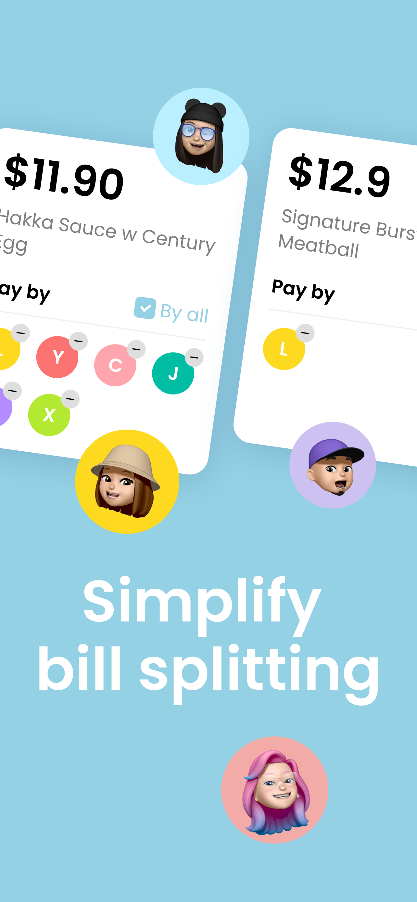
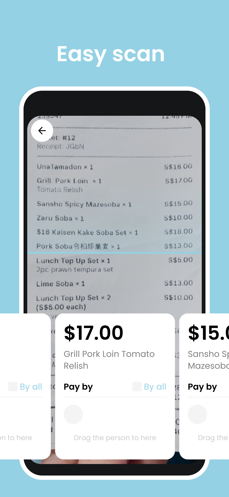

# Welcome to EasySplit!

Hello and welcome to the EasySplit repository!

**EasySplit** is a mobile application designed to streamline bill splitting among friends. It leverages AI to automatically detect prices from images of bills, providing an intuitive user interface for effortless splitting. The app also generates visually appealing shared bill summaries, detailing costs for each individual.

  

Current version on App Store: V1.0.0


## Get Started


Whether you are new to EasySplit or curious about its implementation, you're invited to explore:

- **Download**: You can download EasySplit from the Apple Store under the name "EasySplit: Split Bill Easily".
- **Contribute**: If you are interested in contributing to EasySplit's development or exploring its codebase, you're in the right place.

### Step 1: Clone the EasySplit Repository
```
git clone https://github.com/Tealseed-Lab/EasySplit.git
cd EasySplit
```

### Step 2: Set Up a Local Server

#### 2.1: Go to the Server Code Directory
```
cd easysplit_server
```
#### 2.2: Add the .env File
- Create a .env file under the directory `/easysplit_server`
    ```
    touch .env
    ```
- Add the necessary environment variables
    ```
    GIN_MODE=debug

    # port
    PORT=your_server_port

    # openai
    OPENAI_API_KEY=your_openai_api_key

    # aws
    AWS_ACCESS_KEY_ID=your_aws_access_key_id
    AWS_SECRET_ACCESS_KEY=your_aws_secret_access_key
    AWS_REGION=your_aws_region
    S3_BUCKET_NAME=your_s3_bucket_name

    # gcp
    GCP_CREDENTIALS=your_gcp_credentials
    ```
    Note: For SERVER_PORT, common ports like 8080 or 8000 can be used.

**Getting API Keys and Credentials**
- OpenAI
    1. Create or log into your OpenAI account.
    2. Navigate to the OpenAI API.
    3. Click on your profile icon in the upper right corner and select "API keys" from the dropdown menu.
    4. In the API keys section, click on the "Create new secret key" button.
    5. Name the key and then click on the "Create secret key" button.

- AWS
    1. Create or log into your AWS account.
    2. Create access key ID and secret access key for your user.
    3. Set up your AWS region.
    4. Create an S3 bucket.

- GCP
    1. Create or log into your Google Cloud account.
    2. Navigate to the project selector and create a new project.
    3. Navigate to the API library and enable the Vision API.
    4. Navigate to the service accounts: go to "IAM & Admin" > "Service Accounts" and create a new service account.
    5. Grant the service account access to the project created.
    6. Create a key for the service account.
    7. Note: For GCP_CREDENTIALS, store the contents of the JSON key file as a string in .env file.


#### 2.3: Install Dependencies

Ensure you are in the /easysplit_server directory and install the project dependencies using:
```
go mod tidy
```

#### 2.4: Build and Run the Server

You can build and run the server using the following commands:
```
go build -o easysplit_server
./easysplit_server
```
Alternatively, you can run the server directly with go run:
```
go run main.go
```
#### 2.5: Testing the API
You can use tools like Postman or Curl to test the API endpoints. The base URL will be at `http://localhost:${port_number}`.

Example curl command to test the `/api/v1/receipts/process` endpoint:
```
curl -X POST http://localhost:${port_number}/api/v1/receipts/process -F "receipt_image=@path_to_your_image_file"
```

**Server Files Structure**

```
easysplit_server
├── main.go                   # Entry point of the application
├── api                       # Contains the main application logic
│   ├── controllers           # HTTP handlers
│   ├── models                # Data structures and ORM models
│   ├── routes.go             # Application routes
│   ├── services              # Business logic
│   ├── utils                 # Utility functions
│   └── middlewares           # Middleware functions
├── config                    # Configuration settings
│   └── config.go             # Configuration setup
├── logger                    # Logging configuration
│   └── logging.go            # Logging setup and configuration
├── go.mod                    # Go module file
└── go.sum                    # Go checksums file
```

### Step 3: Set Up a Local Client

#### 3.1: Go to the Client Code Directory
```
cd ../easysplit_client
```

#### 3.2: Install Flutter Dependencies
```
flutter pub get
```

#### 3.3: Navigate to the iOS Directory and Install CocoaPods Dependencies
```
cd ios
pod install
cd ..
```

#### 3.4: Run Code Generation
```
dart run build_runner build
```

#### 3.5: Replace the Server URL
- Edit the file `easysplit_client/lib/common/utils/env/env.dart`
- Replace the YOUR_LOCAL_BASE_URL with your local base url formed by your local ip address and your server port number. 

    For example, it might be something like `http://localhost:8080` or `http://192.168.1.100:8080`

#### 3.6: Run the Flutter App
- Start the ios simulator on your machine
- Run 
    ```
    flutter run
    ```

Now you should have a full running app set up locally in your simulator! 

**Client Files Structure**

```
easysplit_client
├── assets                    # Static assets like images and fonts
├── ios                       # iOS-specific project files
├── lib                       # Main Dart code for the Flutter app
│   ├── common                # Common utilities and widgets
│   ├── di                    # Dependency injection setup
│   ├── modules               # Feature modules of the application
│   └── main.dart             # Entry point of the Flutter application
├── pubspec.lock              # Locked versions of the dependencies
└── pubspec.yaml              # Configuration file specifying dependencies

```

## Feedback and Contributions
If you have any questions, suggestions, or want to report a bug, please feel free to file an issue. Developers interested in contributing are encouraged to open pull requests.

You're also welcomed to contact me at jiatong@tealseed.com! 

Thank you for exploring EasySplit!